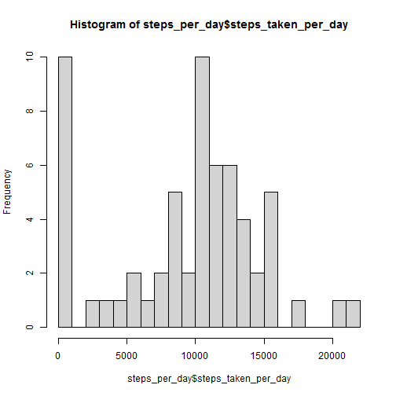
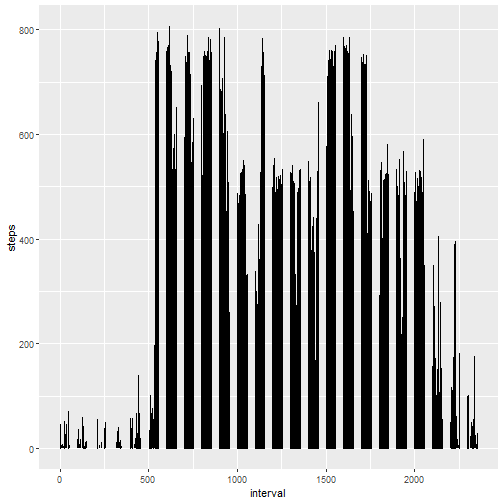
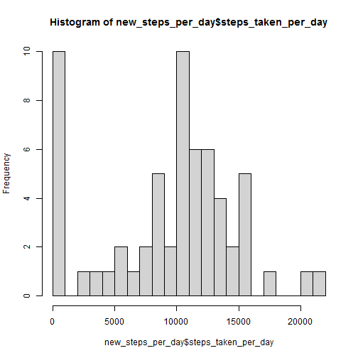
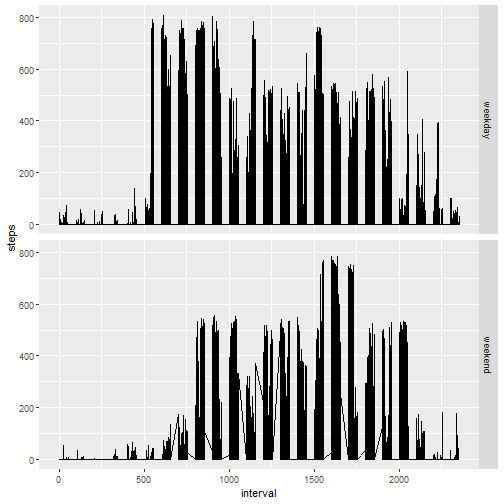

```r
knitr::opts_chunk$set(echo = TRUE)
```

## Loading and preprocessing the data

```r
unzip(zipfile = "activity.zip")
library(dplyr)
activity <- read.csv("activity.csv")
activity <- tbl_df(activity)
```


## What is mean total number of steps taken per day?

```r
# calculate sum of steps taken per day
steps_per_day <- activity %>% group_by(date) %>% summarize (steps_taken_per_day = sum(steps, na.rm = TRUE))

#plot an histogram of the sum of steps taken per day
hist(steps_per_day$steps_taken_per_day, breaks = 30)
```



```r
#Calculate the mean and median of the total number of steps taken per day
mean_median <- activity %>% group_by(date) %>% summarize(mean_steps_per_day = mean(steps,na.rm =TRUE), median_steps_per_day = median(steps, na.rm = TRUE))

#report the mean and median of the total number of steps taken per day
print(mean_median, n = nrow(mean_median))
```

```
## # A tibble: 61 x 3
##    date       mean_steps_per_day median_steps_per_day
##    <chr>                   <dbl>                <dbl>
##  1 2012-10-01            NaN                       NA
##  2 2012-10-02              0.438                    0
##  3 2012-10-03             39.4                      0
##  4 2012-10-04             42.1                      0
##  5 2012-10-05             46.2                      0
##  6 2012-10-06             53.5                      0
##  7 2012-10-07             38.2                      0
##  8 2012-10-08            NaN                       NA
##  9 2012-10-09             44.5                      0
## 10 2012-10-10             34.4                      0
## 11 2012-10-11             35.8                      0
## 12 2012-10-12             60.4                      0
## 13 2012-10-13             43.1                      0
## 14 2012-10-14             52.4                      0
## 15 2012-10-15             35.2                      0
## 16 2012-10-16             52.4                      0
## 17 2012-10-17             46.7                      0
## 18 2012-10-18             34.9                      0
## 19 2012-10-19             41.1                      0
## 20 2012-10-20             36.1                      0
## 21 2012-10-21             30.6                      0
## 22 2012-10-22             46.7                      0
## 23 2012-10-23             31.0                      0
## 24 2012-10-24             29.0                      0
## 25 2012-10-25              8.65                     0
## 26 2012-10-26             23.5                      0
## 27 2012-10-27             35.1                      0
## 28 2012-10-28             39.8                      0
## 29 2012-10-29             17.4                      0
## 30 2012-10-30             34.1                      0
## 31 2012-10-31             53.5                      0
## 32 2012-11-01            NaN                       NA
## 33 2012-11-02             36.8                      0
## 34 2012-11-03             36.7                      0
## 35 2012-11-04            NaN                       NA
## 36 2012-11-05             36.2                      0
## 37 2012-11-06             28.9                      0
## 38 2012-11-07             44.7                      0
## 39 2012-11-08             11.2                      0
## 40 2012-11-09            NaN                       NA
## 41 2012-11-10            NaN                       NA
## 42 2012-11-11             43.8                      0
## 43 2012-11-12             37.4                      0
## 44 2012-11-13             25.5                      0
## 45 2012-11-14            NaN                       NA
## 46 2012-11-15              0.142                    0
## 47 2012-11-16             18.9                      0
## 48 2012-11-17             49.8                      0
## 49 2012-11-18             52.5                      0
## 50 2012-11-19             30.7                      0
## 51 2012-11-20             15.5                      0
## 52 2012-11-21             44.4                      0
## 53 2012-11-22             70.9                      0
## 54 2012-11-23             73.6                      0
## 55 2012-11-24             50.3                      0
## 56 2012-11-25             41.1                      0
## 57 2012-11-26             38.8                      0
## 58 2012-11-27             47.4                      0
## 59 2012-11-28             35.4                      0
## 60 2012-11-29             24.5                      0
## 61 2012-11-30            NaN                       NA
```


## What is the average daily activity pattern?

```r
#time series plot of 5minutes interval
library(ggplot2)
ggplot(activity, aes(x=interval, y = steps))+geom_line()
```

```
## Warning: Removed 2 row(s) containing missing values (geom_path).
```



```r
#maximum number of steps
max <- filter(activity, steps == max(steps, na.rm = TRUE))
max$interval
```

```
## [1] 615
```


## Imputing missing values

```r
#number of missing values
missing_values <- sum(is.na(activity$steps))
missing_values
```

```
## [1] 2304
```

```r
#filling missing value by the mean of steps in that day
new_data <- activity
for(i in 1:nrow(new_data)){
  if (is.na(new_data$steps[i])){
    replacement <- filter(mean_median,date == new_data$date[i])
    new_data$steps[i] <- replacement$mean_steps_per_day
    if (is.na(new_data$steps[i])){new_data$steps[i]<- 0}
  }
}

#histogram of the total number of steps taken each day
new_steps_per_day <-new_data %>% group_by(date) %>% summarize (steps_taken_per_day = sum(steps, na.rm = TRUE))

hist(new_steps_per_day$steps_taken_per_day, breaks = 30)
```



```r
#calculate the mean and median total number of steps taken per day
new_mean_median <- new_data %>% group_by(date) %>% summarize (mean_steps_per_day = mean(steps, na.rm = TRUE), median_steps_per_day = median(steps, na.rm = TRUE))

#report the mean and median of the total number of steps taken per day
print(new_mean_median, n = nrow(new_mean_median))
```

```
## # A tibble: 61 x 3
##    date       mean_steps_per_day median_steps_per_day
##    <chr>                   <dbl>                <dbl>
##  1 2012-10-01              0                        0
##  2 2012-10-02              0.438                    0
##  3 2012-10-03             39.4                      0
##  4 2012-10-04             42.1                      0
##  5 2012-10-05             46.2                      0
##  6 2012-10-06             53.5                      0
##  7 2012-10-07             38.2                      0
##  8 2012-10-08              0                        0
##  9 2012-10-09             44.5                      0
## 10 2012-10-10             34.4                      0
## 11 2012-10-11             35.8                      0
## 12 2012-10-12             60.4                      0
## 13 2012-10-13             43.1                      0
## 14 2012-10-14             52.4                      0
## 15 2012-10-15             35.2                      0
## 16 2012-10-16             52.4                      0
## 17 2012-10-17             46.7                      0
## 18 2012-10-18             34.9                      0
## 19 2012-10-19             41.1                      0
## 20 2012-10-20             36.1                      0
## 21 2012-10-21             30.6                      0
## 22 2012-10-22             46.7                      0
## 23 2012-10-23             31.0                      0
## 24 2012-10-24             29.0                      0
## 25 2012-10-25              8.65                     0
## 26 2012-10-26             23.5                      0
## 27 2012-10-27             35.1                      0
## 28 2012-10-28             39.8                      0
## 29 2012-10-29             17.4                      0
## 30 2012-10-30             34.1                      0
## 31 2012-10-31             53.5                      0
## 32 2012-11-01              0                        0
## 33 2012-11-02             36.8                      0
## 34 2012-11-03             36.7                      0
## 35 2012-11-04              0                        0
## 36 2012-11-05             36.2                      0
## 37 2012-11-06             28.9                      0
## 38 2012-11-07             44.7                      0
## 39 2012-11-08             11.2                      0
## 40 2012-11-09              0                        0
## 41 2012-11-10              0                        0
## 42 2012-11-11             43.8                      0
## 43 2012-11-12             37.4                      0
## 44 2012-11-13             25.5                      0
## 45 2012-11-14              0                        0
## 46 2012-11-15              0.142                    0
## 47 2012-11-16             18.9                      0
## 48 2012-11-17             49.8                      0
## 49 2012-11-18             52.5                      0
## 50 2012-11-19             30.7                      0
## 51 2012-11-20             15.5                      0
## 52 2012-11-21             44.4                      0
## 53 2012-11-22             70.9                      0
## 54 2012-11-23             73.6                      0
## 55 2012-11-24             50.3                      0
## 56 2012-11-25             41.1                      0
## 57 2012-11-26             38.8                      0
## 58 2012-11-27             47.4                      0
## 59 2012-11-28             35.4                      0
## 60 2012-11-29             24.5                      0
## 61 2012-11-30              0                        0
```


## Are there differences in activity patterns between weekdays and weekends?

```r
#function to transform to indicating wether a day is week day or week end (in french and english)
week <- function(x){
  gsub("samedi", "weekend",
    gsub("dimanche", "weekend",
      gsub("lundi","weekday",
        gsub("lundi","weekday",
          gsub("mardi","weekday",
            gsub("mercredi","weekday",
              gsub("jeudi","weekday",
                gsub("vendredi","weekday",
                  gsub("Saturday", "weekend",
                    gsub("Sunday", "weekend",
                      gsub("Monday","weekday",
                        gsub("Tuesday","weekday",
                          gsub("Wednesday","weekday",
                            gsub("Thursday","weekday",
                              gsub("Friday","weekday",
                                x)))))))))))))))
 }

#add new factor indicating a txo levels "weekday " or "weekend"
with_day <- mutate(new_data, day = week(weekdays(as.Date(date))))

ggplot(with_day, aes(x = interval, y = steps))+geom_line()+facet_grid(day~.)
```



